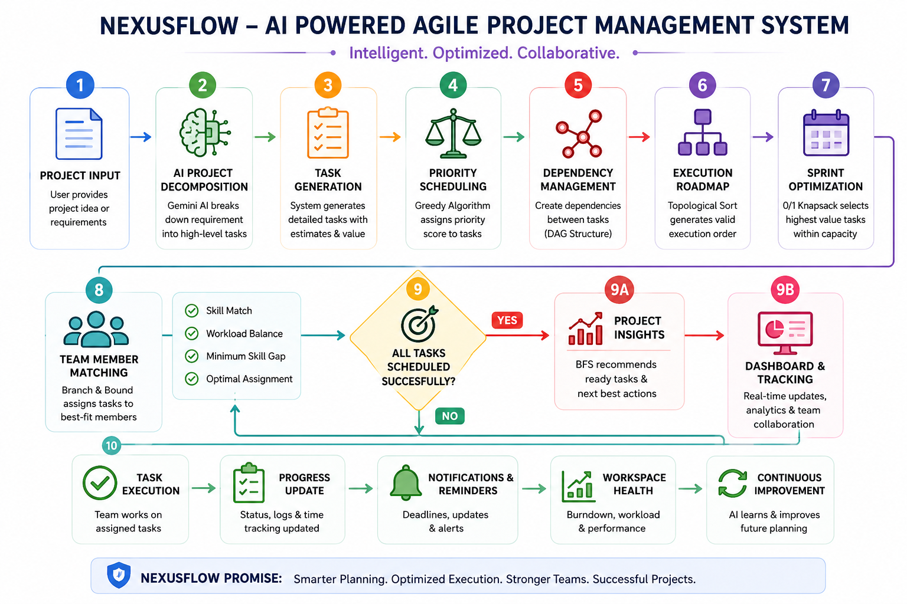
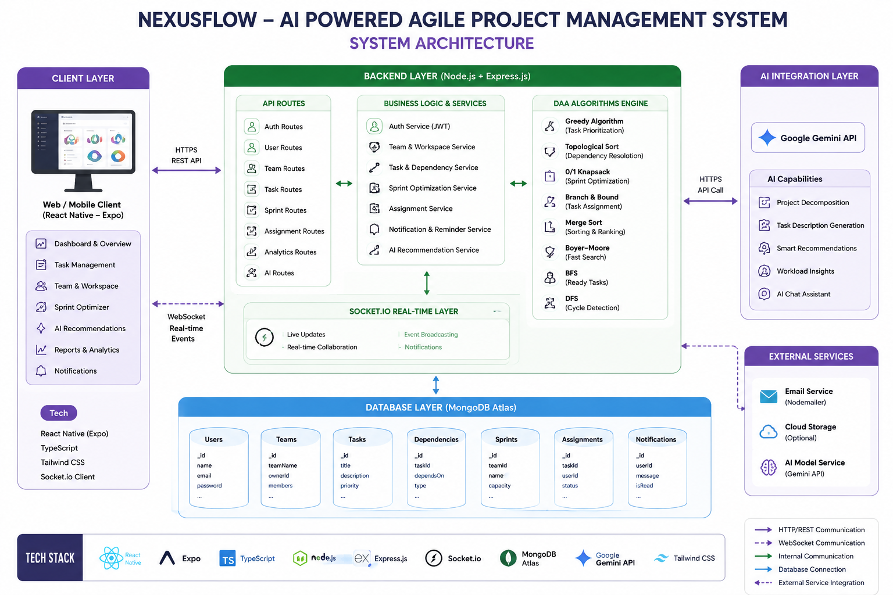

# 🚀 NexusFlow – AI Powered Agile Project Management System

> **An Intelligent Project Management Platform powered by AI and Design & Analysis Algorithms.**
> *Built for Smart Project Planning, Task Scheduling, Sprint Optimization, and Team Collaboration.*

---

# 📖 Project Objective

Managing software projects manually becomes difficult as project size grows. Traditional project management tools require users to create every task, prioritize work manually, and assign members without intelligent assistance.

**NexusFlow** solves this problem by combining **Artificial Intelligence** with **Design & Analysis of Algorithms (DAA)** to automate project planning, optimize sprint scheduling, manage dependencies, recommend task priorities, and intelligently assign work among team members.

---

# 🏗️ System Workflow

<p align="center">

</p>

The workflow begins with project creation, where AI analyzes the project description and automatically decomposes it into meaningful tasks. These tasks are prioritized using Greedy Scheduling, optimized into sprints using 0/1 Knapsack, organized through Topological Sorting, assigned using Branch & Bound, and continuously managed through AI recommendations.

---

# 🏛️ System Architecture

<p align="center">

</p>

The architecture follows a layered design consisting of a React Native frontend, Node.js + Express backend, MongoDB database, Socket.IO real-time communication, Gemini AI integration, and multiple DAA algorithm modules working together to automate project management.

---

# ⚙️ DAA Algorithms Used

| Algorithm | Purpose |
|------------|---------|
| 🟢 Greedy Algorithm | Calculates task priority based on urgency, impact and dependency weight |
| 🟠 0/1 Knapsack | Selects the maximum-value tasks that fit within sprint capacity |
| 🔵 Topological Sort | Generates dependency-aware execution order |
| 🟣 Branch & Bound | Assigns the best team member based on skill-gap cost |
| 🟡 Merge Sort | Sorts tasks by priority, deadline and status |
| 🔍 Boyer–Moore Search | Fast task searching within large backlogs |
| 🌳 BFS | Finds dependency-free (ready) tasks |
| 🌲 DFS | Detects cycles in task dependency graphs |

---

# 🌍 Key Features

- 🤖 AI Project Decomposition
- 📋 Intelligent Task Generation
- ⚡ AI Assisted Task Creation
- 📊 Greedy Task Prioritization
- 🚀 Sprint Optimization
- 🔗 Dependency Graph Generation
- 👥 Smart Team Assignment
- 📈 Analytics Dashboard
- 🔔 Smart Notifications & Reminders
- 💬 Team Collaboration
- 📱 Responsive Modern UI

---

# 🛠️ Technology Stack

### Frontend
- React Native (Expo)
- TypeScript
- Tailwind CSS
- Socket.IO Client

### Backend
- Node.js
- Express.js
- MongoDB
- Socket.IO

### Artificial Intelligence
- Google Gemini API

### Algorithms
- Greedy Algorithm
- 0/1 Knapsack
- Topological Sort
- Branch & Bound
- Merge Sort
- Boyer–Moore Search
- BFS
- DFS

---

# 🚀 How to Run

## Clone Repository

```bash
git clone https://github.com/yourusername/NexusFlow.git
cd NexusFlow
```

## Install Dependencies

### Client

```bash
cd client
npm install
```

### Server

```bash
cd ../server
npm install
```

---

## Configure Environment

Create a `.env` file inside the server folder.

```env
MONGODB_URI=YOUR_MONGODB_URI
JWT_SECRET=YOUR_SECRET
GEMINI_API_KEY=YOUR_GEMINI_API_KEY
```

---

## Start Server

```bash
npm run dev
```

---

## Start Client

```bash
npm start
```

---

# ☁️ Deployment

The project can be deployed using:

- Vercel (Frontend)
- Render / Railway (Backend)
- MongoDB Atlas
- Google Gemini API

---

# 📄 Documentation

Project documentation is available inside the **documents/** folder.

- 📘 DAA Project Report
- 📑 DAA Project Poster

---

# 👨‍💻 Team Members

| Name | USN |
|------|------|
| **Parikshith B** | **1RV25CS416** |
| **Pranav T M** | **1RV24CS197** |
| **Prajwal** | **1RV24CS190** |

---

# 📜 License

This project is developed for **RV College of Engineering** as part of the **Design and Analysis of Algorithms Laboratory (DAA EL)**.

---

# ⭐ If you like this project, consider giving it a star!