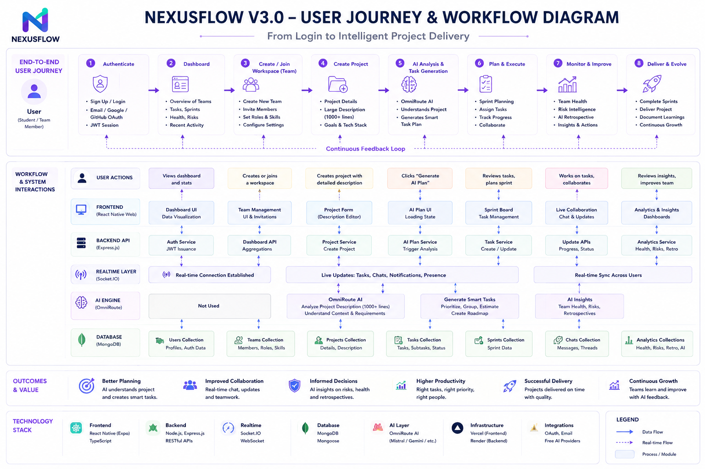
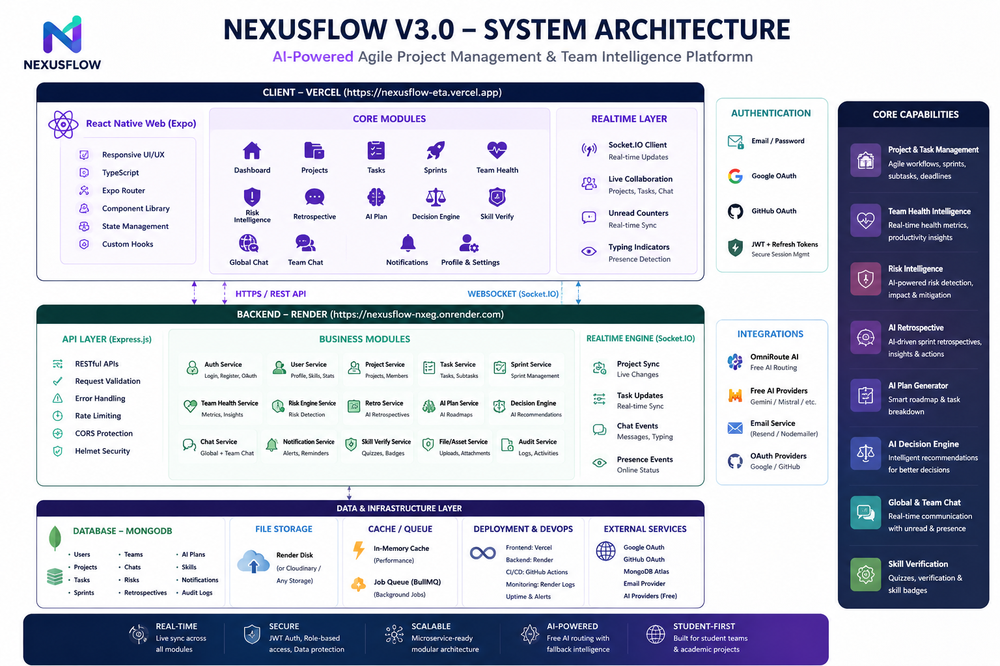

# 🚀 NexusFlow – AI Powered Agile Project Management System

> **An Intelligent Project Management Platform powered by AI and Design & Analysis Algorithms.**  
> *Built for Smart Project Planning, Task Scheduling, Team Collaboration, and Project Intelligence.*

---

# 📖 Project Objective

Managing software projects manually becomes difficult as project size grows. Traditional project management tools require users to create tasks, prioritize work, coordinate teammates, and track progress manually.

**NexusFlow** combines Artificial Intelligence with Design & Analysis of Algorithms (DAA) to simplify project planning, task management, team collaboration, sprint planning, dependency management, and project monitoring.

---

# 🏗️ System Workflow

The workflow takes a project from idea to execution through planning, task creation, team collaboration, sprint management, and continuous monitoring.  
AI assists users with project understanding and recommendations, while deterministic DAA algorithms handle optimization and structured decision-making.  
Real-time synchronization keeps tasks, teams, chats, notifications, and project activity consistent for everyone.

---

# 🏛️ System Architecture

NexusFlow uses a React Native + Expo frontend connected to a Node.js + Express backend and MongoDB database.  
Socket.IO provides real-time collaboration, while authentication, project services, DAA algorithms, GitHub integration, and AI services operate through the backend.  
AI requests are routed through the zero-cost OmniRoute layer with free-provider routes and deterministic fallback support.

---

# ⚙️ DAA Algorithms Used

| Algorithm | Purpose |
|------------|---------|
| 🟢 Greedy Algorithm | Calculates and ranks task priority |
| 🟠 0/1 Knapsack | Selects valuable tasks within sprint capacity |
| 🔵 DFS | Detects dependency cycles |
| 🔵 BFS | Determines dependency levels and execution waves |
| 🟣 Topological Sort | Generates dependency-aware execution order |
| 🟣 Branch & Bound | Finds suitable team-member/task assignments |
| 🟡 Merge Sort | Provides efficient task ordering |
| 🔍 Boyer–Moore | Enables fast task searching |

---

# 🌍 Key Features

### 🤖 AI & Project Assistance
- AI project understanding
- Intelligent task generation
- AI-assisted recommendations
- Project-aware Copilot
- AI sprint retrospective
- Historical learning and recommendations
- AI & dataset resource discovery

### 👥 Team & Collaboration
- Google OAuth authentication
- Email/password authentication
- Forgot-password flow
- Team invitations
- Role-based team management
- Verified member skills
- Skill quizzes and badges
- Team skill graph and skill-gap detection
- Global Chat
- Private Team Chat
- Real-time notifications

### 📋 Project Management
- Workspace creation and management
- Task creation and tracking
- Task priority scoring
- Sprint planning
- Dependency graph
- Analytics dashboard
- Team Health monitoring
- Risk Intelligence
- Decision and opinion tracking

### 🔗 Development Integration
- GitHub repository integration
- Commit / PR / issue activity
- Project activity tracking
- Development progress signals

# 🛠️ Technology Stack

| Layer | Technology |
|-------|------------|
| Frontend | React Native + Expo Router + TypeScript |
| Web | React Native Web |
| Backend | Node.js + Express |
| Real-Time | Socket.IO |
| Database | MongoDB + Mongoose |
| Authentication | JWT + Google OAuth |
| AI | OmniRoute → Gemini Free / OpenRouter Free |
| Repository Integration | GitHub |
| Frontend Deployment | Vercel |
| Backend Deployment | Render |
| Database Hosting | MongoDB Atlas |

---

# 📜 License

This project is developed for **RV College of Engineering** as part of the **Design and Analysis of Algorithms Laboratory (DAA EL)**.

---

# ⭐ NexusFlow

**Plan smarter. Collaborate better. Execute together.**
