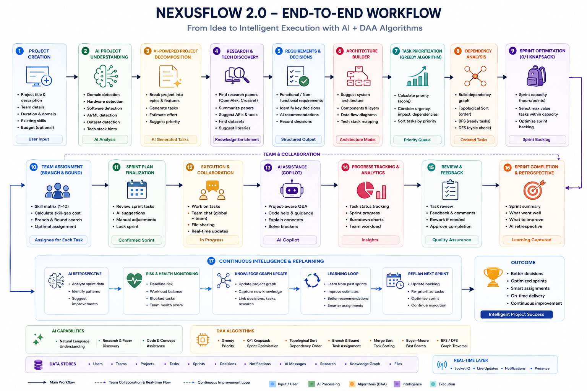
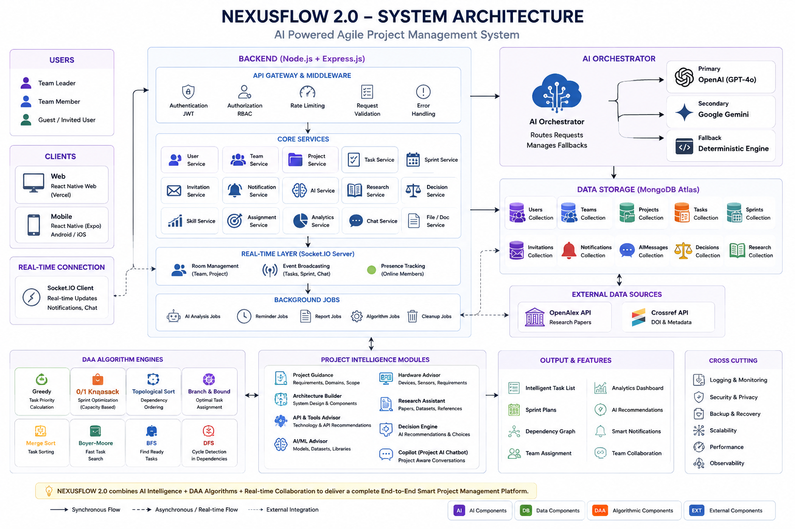

# 🚀 NexusFlow 2.0 – AI Powered Agile Project Management System

> **An Intelligent Project Management Platform powered by AI, Design & Analysis Algorithms, and real-time collaboration.**
> *Built for smart project planning, task scheduling, sprint optimization, dependency management, team assignment, analytics, and collaborative project execution.*

---

# 📖 Project Objective

Managing software projects manually becomes increasingly difficult as project size, task dependencies, and team collaboration grow. Traditional project management tools often require users to create tasks, prioritize work, plan sprints, and distribute responsibilities manually.

**NexusFlow 2.0** combines **Artificial Intelligence** with **Design & Analysis of Algorithms (DAA)** to create an intelligent project management workflow. It can understand project requirements, assist with task decomposition, prioritize work, optimize sprint capacity, analyze dependencies, assign tasks according to member skills, provide project intelligence, and keep collaboration synchronized in real time.

The system is designed around a complete project lifecycle — from project creation and AI-assisted planning to execution, analytics, collaboration, and continuous project guidance.

---

# 🏗️ System Workflow

<p align="center">

</p>

The NexusFlow 2.0 workflow begins with **project creation and AI-powered project understanding**. The system assists in decomposing the project into meaningful tasks, enriching project knowledge through research, structuring requirements and architectural decisions, and prioritizing the backlog.

Dependencies are then analyzed using graph algorithms, sprint capacity is optimized using **0/1 Knapsack**, and tasks are assigned to team members using **Branch & Bound** based on the skill matrix. During execution, real-time collaboration, AI Copilot assistance, progress tracking, analytics, review, and feedback are integrated into the same workflow.

The workflow also supports a **continuous intelligence and replanning loop**, allowing project insights, risks, decisions, and execution feedback to feed into future planning.

---

# 🏛️ System Architecture

<p align="center">

</p>

NexusFlow 2.0 follows a layered architecture consisting of a **React Native / Expo frontend**, **Node.js + Express backend**, **MongoDB Atlas data layer**, **Socket.IO real-time layer**, **Gemini AI integration**, project intelligence services, background processing, and dedicated DAA algorithm engines.

The backend is organized around API middleware, core services, real-time communication, and background jobs. Project data, tasks, sprints, team information, notifications, decisions, research information, and AI-related data are persisted in MongoDB. Socket.IO provides real-time updates for collaboration, task changes, sprint activity, chat, notifications, and presence.

The architecture separates AI-powered intelligence from deterministic DAA computation so that algorithmic decisions such as prioritization, sprint optimization, dependency ordering, and task assignment remain structured and explainable.

---

# ⚙️ DAA Algorithms Used

| Algorithm | Purpose |
|------------|---------|
| 🟢 Greedy Algorithm | Calculates task priority using urgency, impact, dependencies and related scoring factors |
| 🟠 0/1 Knapsack | Selects the highest-value tasks that fit within available sprint capacity |
| 🔵 Topological Sort | Produces dependency-aware task execution order |
| 🟣 Branch & Bound | Finds optimized task-to-member assignments using skill-gap cost |
| 🟡 Merge Sort | Sorts tasks efficiently by priority, deadline, status and related criteria |
| 🔍 Boyer–Moore Search | Provides fast pattern-based searching across task backlogs |
| 🌳 BFS | Identifies dependency-free / ready tasks in the dependency graph |
| 🌲 DFS | Traverses dependency graphs and detects dependency cycles |

---

# 🤖 AI & Project Intelligence

NexusFlow 2.0 integrates AI throughout the project lifecycle instead of limiting AI to a single chatbot.

- 🧠 **Project Understanding** — analyzes project descriptions and identifies domain, scope and relevant technical context
- 📋 **AI Project Decomposition** — assists in converting project ideas into structured epics, features and tasks
- 🔎 **Research Assistant** — supports research discovery, papers, datasets, APIs, tools and technical references
- 🏛️ **Architecture Guidance** — assists with system architecture, components, layers and technical decisions
- 🛠️ **API & Tools Advisor** — recommends technologies, libraries and development tools
- 🤖 **AI/ML Advisor** — assists with models, datasets and AI/ML-related project decisions
- 💬 **Project Copilot** — provides project-aware conversational assistance and guidance
- ⚖️ **Decision Engine** — supports structured decision-making and recommendation workflows
- 📊 **AI Recommendations** — provides project guidance based on available project data and execution context

---

# 🌍 Key Features

### 📋 Intelligent Project Management
- 🤖 AI Project Understanding
- 📋 AI-Powered Project Decomposition
- ⚡ AI-Assisted Task Creation
- 📊 Intelligent Task Prioritization
- 🚀 Sprint Capacity Optimization
- 🔗 Dependency Graph Analysis
- 👥 Skill-Based Task Assignment

### 🧠 Project Intelligence
- 📘 Project Guidance
- 🔎 Research & Paper Discovery
- 🏛️ Architecture Guidance
- 🛠️ API & Tools Recommendations
- 🤖 AI/ML Guidance
- ⚖️ Decision & Recommendation Engine
- 💬 Project Copilot

### 📈 Execution & Analytics
- 📊 Analytics Dashboard
- 📌 Task Progress Tracking
- 🚀 Sprint Planning and Monitoring
- 🔗 Dependency Visualization
- 👥 Team Assignment Insights
- 🔔 Notifications and Reminders
- 🧠 Continuous Project Guidance

### 💬 Collaboration
- 💬 Team Collaboration
- ⚡ Real-Time Project Updates
- 🔔 Real-Time Notifications
- 👤 Team Presence Tracking
- 📱 Responsive Workspace Experience

---

# 🛠️ Technology Stack

### Frontend
- React Native
- Expo
- TypeScript
- React Native Web
- Socket.IO Client

Deployed frontend: https://nexusflow-eta.vercel.app/

### Backend
- Node.js
- Express.js
- MongoDB / MongoDB Atlas
- Socket.IO

Deployed backend: https://nexusflow-nxeg.onrender.com/

### Artificial Intelligence
- Google Gemini API

### Algorithms
- Greedy Algorithm
- 0/1 Knapsack
- Topological Sort
- Branch & Bound
- Merge Sort
- Boyer–Moore Search
- BFS
- DFS

---

# 🔄 Real-Time Collaboration Architecture

NexusFlow 2.0 uses **Socket.IO** to reduce the need for manual page refreshes during collaborative work.

Real-time communication supports:

- 💬 Team and project chat
- 📋 Task updates
- 🚀 Sprint activity
- 🔔 Notifications
- 👥 Member / presence updates
- 📊 Collaborative project-state changes

The goal is to keep the workspace state synchronized across active team members while maintaining MongoDB as the persistent source of project data.

---

# 🚀 How to Run

## Clone Repository

```bash
git clone https://github.com/Parik-2006/NEXUSFLOW-.git
cd NEXUSFLOW-
```

## Install Dependencies

### Client

```bash
cd client
npm install
```

### Server

```bash
cd ../server
npm install
```

---

## Configure Environment

Create a `.env` file inside the server folder.

```env
MONGODB_URI=YOUR_MONGODB_URI
JWT_SECRET=YOUR_SECRET
GEMINI_API_KEY=YOUR_GEMINI_API_KEY
```

Never commit real API keys, database credentials, JWT secrets, or other sensitive environment variables to the repository.

---

## Start Server

```bash
npm run dev
```

## Start Client

```bash
npm start
```

---

# ☁️ Deployment

NexusFlow 2.0 can be deployed using:

- **Vercel** — Frontend
- **Render / Railway** — Backend
- **MongoDB Atlas** — Database
- **Google Gemini API** — AI services

### Current Deployment

**Frontend:** https://nexusflow-eta.vercel.app/

**Backend:** https://nexusflow-nxeg.onrender.com/

---

# 📄 Documentation

Project documentation is available inside the **documents/** folder.

- 📘 DAA Project Report
- 📑 DAA Project Poster
- 🏛️ Version 2.0 System Architecture
- 🏗️ Version 2.0 End-to-End Workflow

---

# 👨‍💻 Team Members

| Name | USN |
|------|------|
| **Parikshith B** | **1RV25CS416** |
| **Pranav T M** | **1RV24CS197** |
| **Prajwal** | **1RV24CS190** |

---

# 🎓 Academic Context

This project is developed for **R V College of Engineering** as part of the **Design and Analysis of Algorithms Laboratory (DAA EL)**.

NexusFlow demonstrates how classical DAA techniques can be integrated with modern AI services, real-time communication, persistent data storage, and project management workflows to build an intelligent software engineering platform.

---

# 📜 License

This project is developed for academic and educational purposes as part of the **DAA EL project at R V College of Engineering**.

---

# ⭐ If you like NexusFlow, consider giving the repository a star!